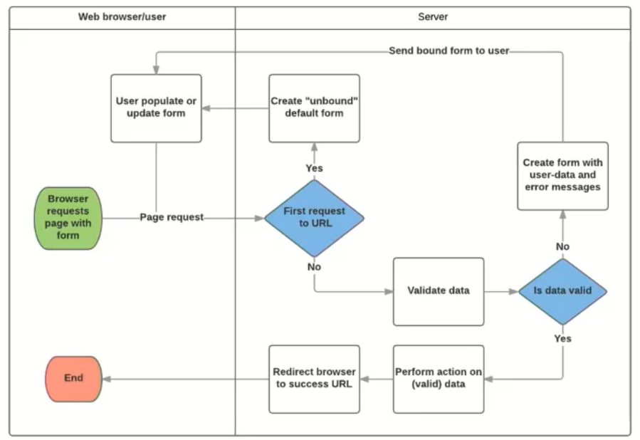
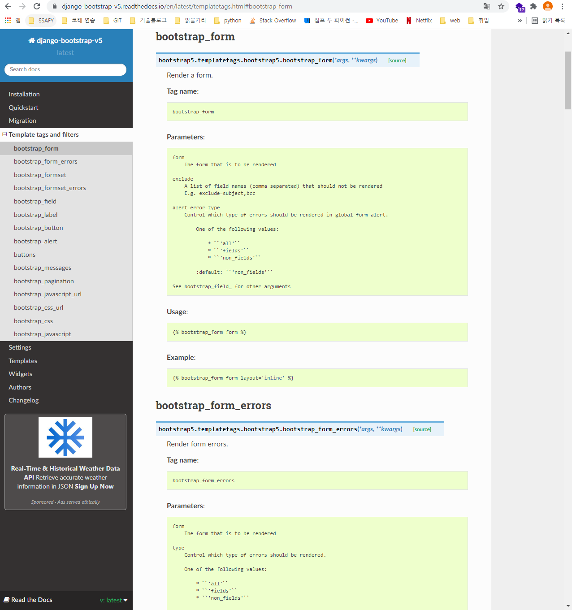

# Django


- ### 준비


​	(파일 생성 후 파일로 들어감)

```
mkdir <파일 이름>
cd <파일 이름>
```


1. 가상환경 설정 및 활성화

```
python -m venv venv
source venv/Scripts/activate
```


2. README 파일, .gitignore 파일 생성

```
touch README.md .gitignore
```

- gitignore.io 에서 windows, macos, django, visualstudiocode, python 쓰고 .gitignore 파일에 붙여넣기


2. 장고 설치

```
pip install django
또는
pip install django django_extensions
```

+

```
pip freeze > requirements.txt
```

cf. requirements.txt.  다운

```
pip install -r requirements.txt
```

- 가상환경 켜기 전에 다운하면 전역에 설치, 가상환경 켜고 다운하면 가상환경 내에만 설치됨

  (다른 사람 프로젝트 다운 받으면 가상환경부터 설정하고 세팅)


3. 프로젝트 파일 생성

```
django-admin startproject <프로젝트 이름> .
```

-  . 빼먹지 말기!!!!


4. 앱 생성 및 앱 등록

```
python manage.py startapp <앱 이름>
```

- 프로젝트 파일 - settings.py - INSTALLED_APPS 에서 앱 등록


- ### 시작

1. 앱 폴더, 프로젝트 폴더와 같은 레벨에 templates 폴더 > base. html

```
mkdir templates
```

```
base.html
```

- ! + tab 해서 기본구조
- 부트스트랩 css, javascript 파일 불러오기
- body에 `` `` 넣기!!
- 프로젝트 파일 - settings.py - TEMPLATES 에서 'DIRS' : [BASE_DIR / 'templates'] 쓰기
- 상속받을 html파일 최상단에 


2. 프로젝트 폴더 - urls.py

- import include 추가
- 앱 경로 설정

```python
path('<앱 이름>/', include('<앱 이름>.urls'))
```


##### < urls.py - views.py - html >

3. 앱 폴더 - urls.py 파일 생성

- app_name 쓰기

```python
app_name = "<앱 이름>"
```

- 경로 설정

```python
from django.urls import path
from . import views
```

```python
urlpatterns = [
	path(''),
	path(),
	path(),
]
```


6. 앱 폴더 - models.py에서 클래스 생성, 변수(필드명) 쓰기

```python
class <모델명>(models.Model):
    <변수명> = models. ~ ()
    <변수명> = models. ~ ()
    ...
+
	def __ str __(self):
		return self.<변수명>
    	# or
        return f'{self.pk}: {self.title}'
```

** models.py에 수정사항이 생기면 migrate 다시 하기

```python
python manage.py makemigrations
```

```python
python manage.py migrate
```


관리자 페이지

```python
python manage.py createsuperuser
```

```python
# admin.py
from .models import <모델명>

admin.site.register(<모델명>)
```


4. forms.py 생성

```python
from django import forms
from .models import Article

class ArticleForm(forms.ModelForm):
    class Meta():
        model = Article
        fields = '__all__'
```


4. views.py에서 함수 작성

```python
import redirect
from .models import Article
from .forms import ArticleForm
```

```python
# 함수들 구조 잡아놓고 시작
def index():
    pass

def detail():
    pass

def create():
    pass

def update():
    pass

def delete():
    pass
```

```python
articles = Article.objects.all()
articles = Article.objects.order_by('-pk')   # pk가 높은 순으로 내림차순
article = Article.objects.get(pk=pk)
```


+ 추가

```python
from django.shortcuts import render, redirect, get_object_or_404
from django.views.decorators.http import require_http_methods, require_POST, require_safe
```

```python
# GET 방식 (index, detail)
@require_safe

# GET + POST 방식 (create, udpate)
@require_http_methods(['GET', 'POST'])

# POST 방식 (delete)
@require_POST
```


5. 앱 폴더에 templates 폴더 생성 >  앱 이름으로 하위 폴더 생성 > html 파일들

```
index.html
detail.html
form.html
```


서버 실행

```python
python manage.py runserver
```


# <코드 예시>

```python
# urls.py
app_name = 'articles'

urlpatterns = [
    path(''. views.index, name='index'),
    path('<int:pk>/', views.detail, name='detail'),
    path('create/', views.create, name='create'),
    path('<int:pk>/update/', views.update, name='update'),
    path('<int:pk>/delete/', views.delete, name='delete'),
]
```

```python
# models.py
class Article(models.Model):
    title = models.CharField(max_length= )
    content = models.TextField()
```


# views.py 함수 코드

### index

```python
def index(request):
    
    article = Article.object.all()
    
    context = {
        'articles': articles,
    }
    
    return render(request, 'articles/index.html', context)
```

##### ex. index.html

```html



<ul>
	
	<li>
		<a href=>{{ article.title }}</a>
	</li>
	  
</ul>

```


### create

- new + create

```python
def create(request):
    
    if request.method == 'POST':
        form = ArticleForm(request.POST)
        
        # 1. index페이지로 redirect
        if form.is_valid():
            form.save()
            return redirect('articles:index')
        
        # or
        # 2. detail페이지로 redirect
        if form.is_valid():
            article = form.save()
            return redirect('articles:detail', article.pk)
    else:
        form = ArticleForm()
        
    context   = {
        'form': form,
    }
    
    return render(request, 'articles/index.html', context)
```

##### ex. form.html

```python




<form action="" method="POST">     # action="" 비워두면 같은 위치로 요청 보냄, 방식은 POST로 변경
	
    {{ form.as_p }}
	<button>제출</button>    # 자동으로 type="submit"으로 설정됨  => <input type="submit">과 같은 역할
</form>


```

- <label> & <input> 쌍 출력 옵션

1. as_p() : 각 필드가 <p>태그로 감싸져서 렌더링
2. as_ul() : 각 필드가 <li>태그로 감싸져서 렌더링 (<ul> 태그는 직접 작성해야 함)
3. as_table() : 각 필드가 <tr>태그로 감싸져서 렌더링 (<table> 태그는 직접 작성해야 함)


### update

- edit + update

```python
def update(request, pk):
    
    article = Article.objects.get(pk=pk)
    
    if request.method == 'POST':
        form = ArticleFor(request.POST, isntance=article)
        
        if form.is_valid():
            form.save()
            return redirect('articles:index')
    else:
        form = ArticleForm(instance=article)
        
    context = {
        'form': form,
    }
    
    return render(request, 'articles/update.html', context)
```


### delete

```python
def delete(request, pk):
    
    article = Article.objects.get(pk=pk)
    
    if request.method == 'POST':
        article.delete()
        return redirect('articles:index')
    
    else:
        return redirect('articles:detail', article.pk)
```


# Django Form

- 역할

1. 유효성 검사 (data validation)
2. HTML (<input>) 생성


- workflow




### cf. django-bootstrap-v5


```
pip freeze > requirements.txt
```


Add to INSTALLED_APPS in your `settings.py`:

> ```
> 'bootstrap5',
> ```


```
# base.html 최상단

```

- 사용하려는 페이지마다 최상단에 추가(form.html)


```python
# form.html





  
    <h1>CREATE</h1>
  
     <h1>UPDATE</h1>
  

  <form action="" method="POST">
    
    

    <input type="submit">
  </form>

```

- {{ form }} => 




```python
# 여러가지 옵션 추가 가능 (django-bootstrap-v5 공식페이지 참고)
ex.




```

