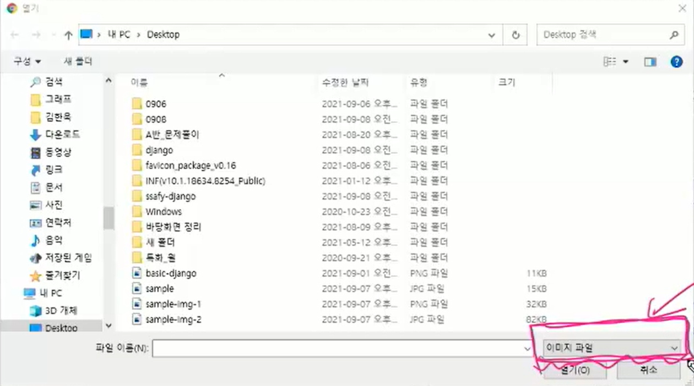

# Static file (정적 파일)

: 응답 시 별도 처리 없이 내용을 그대로 보여주면 되는 파일

(사용자의 요청에 따라 내용이 바뀌지 않고 요청한 것을 그대로 보여줌)


- Static file 4단계 구성

```python
# 이미 포함되어 있는 부분

# settings.py
INSTALLED_APPS = [... , django.contrib.staticfiles]
STATIC_URL = '/static/'
```

```python
# 추가해야 하는 부분

# Template tag
# 1. load : 템플릿 최상단

# 2. static : STATIC_ROOT에 저장된 정적 파일에 연결


# 앱 폴더 > static 폴더 생성 > 앱 이름의 폴더(namespace) 생성 > 이미지 파일 넣기
ex. my_app/static/my_app/example.jpg
```


- `STATIC_URL`

: STATIC_ROOT에 있는 정적 파일을 참조할 때 사용하는 URL

: 정적 파일들이 저장되어 있는 기본경로('app/static/')와 STATICFILES_DIRS에 정의된 추가 경로들을 탐색

: 실제 파일이나 디렉토리가 아니라 URL로만 존재


- `STATICFILES_DIRS`

: 기본경로('app/static/') 경로 외에 추가적인 정적 파일 경로 목록을 정의하는 리스트

1. 앱 폴더, 프로젝트 폴더와 같은 레벨에 static 폴더 > images 폴더 생성 후 이미지 폴더에 이미지 넣기

```python
# 2. settings.py에 추가
STATICFILES_DIRS = [BASE_DIR / 'static']
```

```python

```


cf. `STATIC_ROOT` 

: 실제 배포 환경에서 모든 정적 파일을 다른 웹 서버에 제공하기 위해 프로젝트에서 사용하는 모든 정적 파일을 한 곳에 모아놓는 경로 (collectstatic이 배포를 위해 정적파일을 수집하는 디렉토리의 절대 경로)

: 개발 과정에서 settings.py > DEBUG=True로 되어 있으면 작용하지 않음. 직접 작성하지 않으면 자동으로 생성되지 않음


### Media file

: 사용자가 업로드하는 정적 파일


- `FileField`

: 파일 업로드에 사용하는 모델 필드

** 선택인자 upload_to : 이미지가 업로드되는 디렉토리와 파일 이름을 설정하는 방법 제공 (2가지)

1. 문자열 값이나 경로 지정

```python
# models.py
class MyModel(models.Model):
    # 1) MEDIA_ROOT/uploads/에 업로드
    upload = models.FileField(upload_to='uploads/')
    # 2) MEDIA_ROOT/uploads/2021/09/09/에 업로드
    upload = models.FileField(upload_to='uploads/%Y/%m/%d/')
```

 

2. 함수 호출

: 특정 함수가 경로를 리턴, 리턴값을 결과값으로 사용

** 함수 인자는 반드시 2개! => instance, filename

```python
# models.py (ex. )
def articles_image_path(instance, filename):
    return f'user_{instance.user.pk}/{filename}'
		# MEDIA_ROOT/user_<pk>/ 경로로 <filename> 이름으로 업로드

class Article(models.Model):
    image = models.ImageField(upload_to=articles_image_path)
```

- instance

: FileField가 정의된 모델의 인스턴스

: 아직 데이터베이스에 객체가 저장되기 전이기 때문에 pk 값이 없을 수 있음 (None으로 저장됨 , 이후 수정시 pk값으로 변경)

- filename

: 기존 파일에 제공된 파일 이름


#### 이미지 업로드 (CREATE)

- `ImageField`

: 이미지 업로드에 사용하는 모델 필드

: `FileField`를 상속받는 서브클래스이므로 `FileField`의 모든 속성 및 메서드 사용 가능

: `ImageField` 인스턴스는 최대 길이 100자인 문자열로 DB에 저장됨 (max_length인자로 변경 가능)

1. upload_to='MEDIA_ROOT/ 이후의 경로'

2. blank=True

   : 기본값 (False)

   : 이미지 필드에 빈 값(DB에 빈 문자열 저장)이 허용되도록 설정 (이미지를 선택적으로 업로드)

   : 유효성 검사를 통과함 (is_valid)

   cf. null

   ​	: 기본값 (False)

   ​	: True면 빈 값을 NULL로 저장

   ​	: 주의 사항!!! CharField, TextField와 같은 문자열 기반 필드에서 사용을 피해야 함

   ​	('데이터 없음'에 대해 1. 빈 문자열 2. NULL 두 개의 중복값을 가지게 됨)


##### 준비 사항 3가지

1. `MEDIA_ROOT`

: 사용자가 업로드 한 파일(미디어 파일)들을 보관하는 디렉토리의 절대 경로

(DB에는 업로드된 파일이 저장되지 않고 파일의 경로가 저장됨)

```python
# settings.py에 경로 지정 (폴더는 사용자가 업로드하면 자동 생성됨)
MEDIA_ROOT = BASE_DIR / 'media'
```


2. `MEDIA_URL`

: MEDIA_ROOT에서 제공되는 미디어파일(업로드 된 파일)의 URL을 만들어 줌

```python
# settings.py
MEDIA_URL = '/media/'
```


3. 

https://docs.djangoproject.com/ko/3.2/howto/static-files/#serving-files-uploaded-by-a-user-during-development 에서 복붙하기

```python
# 프로젝트 > urls.py
from django.conf.urls.static import static
from django.conf import settings   # => settings.py 파일 자체를 가져옴
```

```python
urlpatterns = [
	...
] + static(settings.MEDIA_URL, document_root=settings.MEDIA_ROOT)
```


##### + Pillow 라이브러리

: ImageField를 사용하기 위해서는 반드시 Pillow 라이브러리 필요

: makemigrations하려고 하면 Pillow 라이브러리 설치를 위한 에러 창이 뜸

```
pip install Pillow
```

```
pip install django-imagekit
```

+

```
pip freeze > requirements.txt
```

```
python manage.py makemigrations
```

```python
python manage.py migrate
```


- ##### form태그에 `enctype="multipart/form-data"` 추가

```python
# form 태그에 enctype 속성 지정
<form action="" method="POST" enctype="multipart/form-data">
```

: 파일/이미지 업로드 시 반드시 사용해야 함 (전송되는 데이터의 형식을 지정)

( <input type="file"> 을 사용하는 경우)

https://developer.mozilla.org/ko/docs/Web/HTML/Element/form


- ##### views.py > 함수에 `request.FILES` 추가

: 이미지는 request.POST가 아닌 request.FILES에 있음 => is_valid()를 통과하지 못함

```python
def create(request):
    if request.method == 'POST':
        form = ArticleForm(request.POST, request.FILES)
        if form.is_valid():
            article = form.save()
            return redirect('articles:detail', article.pk)
    else:
        form = ArticleForm()
    context = {
        'form': form,
    }
    return render(request, 'articles/create.html', context)
```


##### cf. input 태그 > accept="image/*" (고유 파일 유형 지정자)



: 입력 허용할 파일 유형을 나타내는 문자열

: 파일 검증을 하는 것은 아님 (이미지를 accept 하더라도 비디오나 오디오 파일 제출 가능)


#### 이미지 조회 (READ)

- `article.image.url` => 업로드 파일의 경로
- `article.image` => 업로드 파일의 파일 이름

```python

```


#### 이미지 업로드 (UPDATE)

- 이미지 일부만 수정하는 것 불가 => 새로운 이미지로 덮어씌우기
- create 함수와 동일
  - update.html > form태그에 `enctype="multipart/form-data"` 추가
  - views.py > 함수에 `request.FILES` 추가 (* 키워드인자보다 앞에 쓰기 or files=request.FILES라고 명시)

- 이미지 파일이 없는 게시글의 경우 Detail 페이지에 ValueError 발생

```html
# 방법 1 (if문)

	
​```

	
​```

```


#  image resizing

https://github.com/matthewwithanm/django-imagekit

- installation

1. `pip install django-imagekit`
2. Add `'imagekit'` to your `INSTALLED_APPS` list in your project's settings.py

- usage

```python
# models.py
# ProcessImageField
# 원본을 저장하지 않는 방식 + 이미지가 사이즈에 맞게 잘려서 저장됨
from imagekit.models import ProcessedImageField
from imagekit.processors import ResizeToFill

class Profile(models.Model):
    avatar_thumbnail = ProcessedImageField(upload_to='avatars',
                                           processors=[ResizeToFill(100, 50)],
                                           format='JPEG',
                                           options={'quality': 60})
```

```python
# ImageSpecField
# 일단 원본을 저장, 조회를 하면 만들어지는 방식(필요할 때만 생성) + 이미지가 잘리지 않고 줄어듦
from imagekit.models import ImageSpecField
from imagekit.processors import ResizeToFill

class Profile(models.Model):
    avatar = models.ImageField(upload_to='avatars')
    avatar_thumbnail = ImageSpecField(source='avatar',
                                      processors=[ResizeToFill(100, 50)],
                                      format='JPEG',
                                      options={'quality': 60})
    
# 변수에 avatar(image) 대신 avatar_thumbnail(image_thumbnail)로 바꿔야 함
```

(+ models.py 수정 => makemigrations/migrate 다시 하기

** ProcessedImageField() 내의 요소만 변경하는 경우는 makemigrations할 필요없음 (해보면 변경사항 없다고 뜸))
